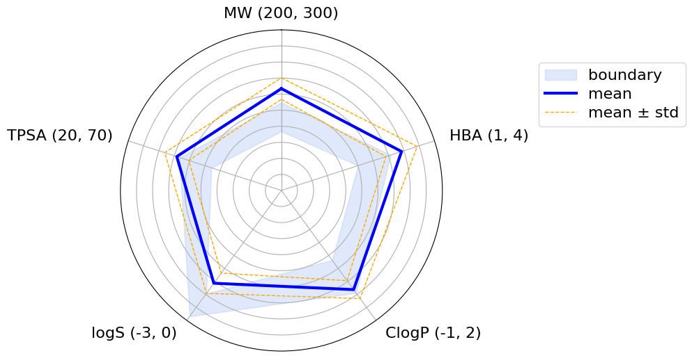

# Molecular Radar Plot

A flexible Python tool for generating radar plots to visualize molecular properties using RDKit descriptors. This tool allows you to visualize and analyze the distribution of any molecular descriptor available in RDKit across your chemical dataset.

## Key Features

- Support for multiple input formats (SMILES, SDF)
- Visualization of molecular property distributions with mean and standard deviation
- Flexible descriptor selection using any RDKit molecular descriptor
- Customizable property ranges for visualization
- Support for pre-calculated descriptors in SDF files

## Installation

### Prerequisites
```bash
pip install rdkit pandas matplotlib numpy tqdm
```

## Usage

Basic usage with SMILES input:
```bash
python molecular-radar-plot.py -i molecules.smi --MW 200,500 --HBA 2,5 --HBD 1,3
```

Using SDF file with existing descriptors:
```bash
python molecular-radar-plot.py -i molecules.sdf -e "MW:[200,500] HBA:[2,5] HBD:[1,3]"
```

### Command Line Arguments

- `-i, --input`: Path to input file (supports .smi, .txt, or .sdf)
- `-o, --output`: Path to output plot (default: molecular_radar_plot.png)
- `-e, --exist`: Descriptors that already exist in the SDF file (format: "DESC1:[min1,max1] DESC2:[min2,max2]")
- `--{descriptor}`: Any RDKit descriptor with its range (format: min,max)

Available descriptors include any molecular descriptor from RDKit's Descriptors module. Some common examples:
- `MW`: Molecular Weight
- `TPSA`: Topological Polar Surface Area
- `LogP`: Calculated LogP
- `HBA`: Number of H-Bond Acceptors
- `HBD`: Number of H-Bond Donors
- `RotatableBonds`: Number of Rotatable Bonds

## Output

The tool generates a radar plot showing:
- Blue shaded area: Property boundaries
- Blue solid line: Mean values
- Orange dashed lines: Standard deviation bounds



## Advanced Usage

You can use any descriptor available in RDKit by specifying it as a command-line argument. For example:

```bash
python molecular-radar-plot.py -i molecules.smi \
    --MW 200,500 \
    --TPSA 40,140 \
    --NumRotatableBonds 0,10 \
    --NumHAcceptors 2,8 \
    --NumHDonors 0,5 \
    --MolLogP -0.4,5.6
```

## Contributing

Feel free to open issues or submit pull requests with improvements or bug fixes.
